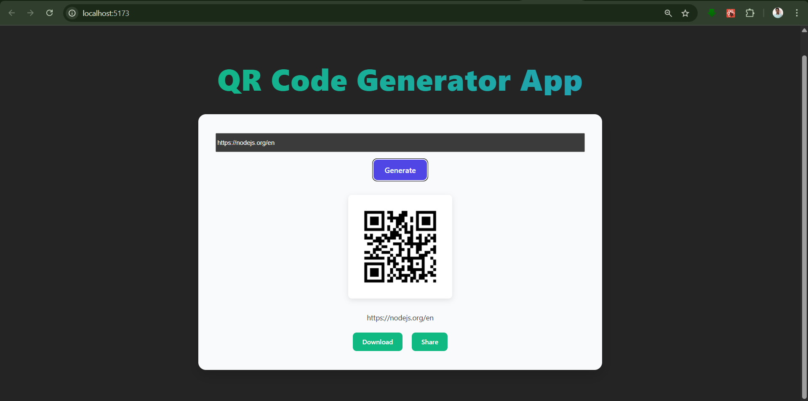

# 🔳 MERN QR Code Generator

A full-stack MERN (MongoDB, Express.js, React.js, Node.js) application that allows users to input a URL and generate a corresponding QR code. The generated QR code can be downloaded or shared directly.

## 📌 Features

- 🔗 URL input field
- ⚙️ QR code generation from entered URL
- 💾 Download QR code as image
- 📤 Share QR code via Web Share API (on supported devices)

---

## 🛠️ Tech Stack

**Frontend:**
- React.js
- Vite (or Create React App)
- Axios
- qrcode.react (or any other QR code library)

**Backend:**
- Node.js
- Express.js
- CORS

**Other:**
- MongoDB (Optional: if you want to log URLs or store user history)

---

Note: use Node version above 21

